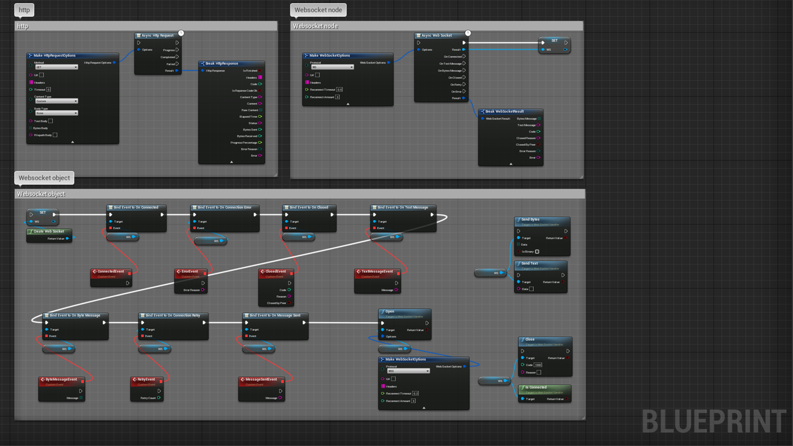
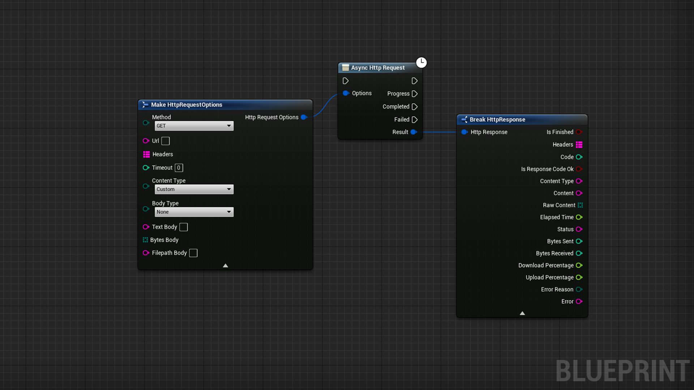
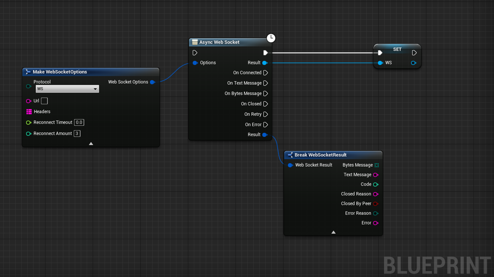
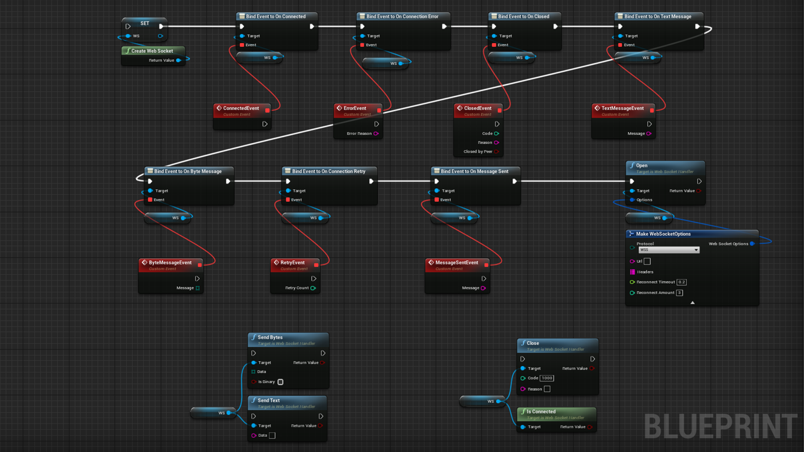

# HttpHelper

- UE Plugin to handle http(s) request and websocket communication
- It exposes async node to quickly make an http(s) request or establish a websocket communication
- Supports GET, POST, PUT, DELETE, HEAD, PATCH method for http request
- Supports text, bytes, file streaming payload for http request
- Customize http/websocket headers
- Support WS, WSS protocols for websocket connections
- Use async nodes for quick callbacks access and usage
- Can be used in any blueprint

 

[Link to the plugin in the marketplace](https://www.unrealengine.com/marketplace/en-US/product/d6e73d57925e4acf89649cea5b686e86)

# Documentation

 

# HttpRequest

    Note: Always specify a content type when you set a body whether it's text/bytes/file. You can use the preset content type selection to set the content type header, if you want to set a custom one, select the "Custom" option and set it yourself in the headers map
 

    To add a body to your request, specify the body type otherwise it won't be sent, you can have a text/bytes/file body
 
    
    Completed callback is triggered when the request was processed and is finished, you can check the "Code" or "IsResponseCodeOk" to confirm the response you have got, code 2xx means the request was a success otherwise it's not
 
    
    Failed callback is triggered when an error occurs, you can check the "ErrorReason" and "Error" properties to have more details about it
 
    
    Progress callback is triggered during the request to indicate the state of the request, if you download or send a body, you can follow it with the "BytesSent", "BytesReceived", "DownloadPercentage", "UploadPercentage" properties, if "DownloadPercentage" or "UploadPercentage" returns -1, this means the body is empty or the Content-Length header is missing and we can't compute the percentage

| Node | Inputs | Outputs | Note |
| ---- | ------ | ------- | ---- |
| AsyncHttpRequest | HttpRequestOptions | HttpResponse | Async node to call an url using a specified method, custom headers, timeout, specific body |

# Websocket

You can use the async node to quickly establish a websocket connection and receive the various callbacks with their results, or choose the traditional approach and bind the events to the callbacks yourself

    Note: Specify the headers before the node activation for them to be taken into account
 

    "ReconnectTimeout" and "ReconnectAmount" allows you to retry a connection when a connection error is catched, specify a timeout > 0 and amount > 0 to use this feature

## Async node

    The async node returns a websocket handler which you can use to send data or close the connection
 

    Calling this async node again won't start another connection unless you closed the previous one

| Node | Inputs | Outputs | Note |
| ---- | ------ | ------- | ---- |
| AsyncWebSocket | WebSocketOptions | WebSocketResult | Async node to establish websocket communication using specified protocol and headers |

## Traditional nodes

    Note: Bind the events before opening the communication to receive them properly

| Node | Inputs | Outputs | Note |
| ---- | ------ | ------- | ---- |
| CreateWebSocket | void | WebSocketHandler | Save the handler into a variable for easier access |
| BindEventToOnConnected | Callback Event | void | Called when connected to a peer |
| BindEventToOnConnectionError | Callback Event | ErrorReason(String) | Called when an error occured with the connection |
| BindEventToOnClosed | Callback Event | Code(Int), Reason(String), ClosedByPeer(Bool) | Called when the communication is closed due to an error or by a peer |
| BindEventToOnTextMessage | Callback Event | Message(String) | Called when receiving a text message by a peer |
| BindEventToOnByteMessage | Callback Event | Message(Array(Byte)) | Called when receiving a raw message by a peer, whether it's a text or binary message |
| BindEventToOnConnectionRetry | Callback Event | RetryCount(Int) | Called when retrying to open a communication after an error |
| BindEventToOnMessageSent | Callback Event | Message(String) | Called when a text message was sent |
| Open | WebSocketOptions | Result(Bool) | Try to open the connection, returns true if the websockethandler sent the open command, to know if the connection was established successfully, bind an event to OnConnected |
| Close | Code(Int), Reason(String) | Result(Bool) | Try to close the connection, returns true if the websockethandler sent the close command, to know if the connection was terminated, bind an event to OnClose |
| IsConnected | void | Result(Bool) | Tells if the websockethandler has an opened communication with a peer |
| SendBytes | Data(Array(Byte)), IsBinary(Bool) | Result(Bool) | Try to send bytes over the communication |
| SendText | Data(String) | Result(Bool) | Try to send string over the communication |