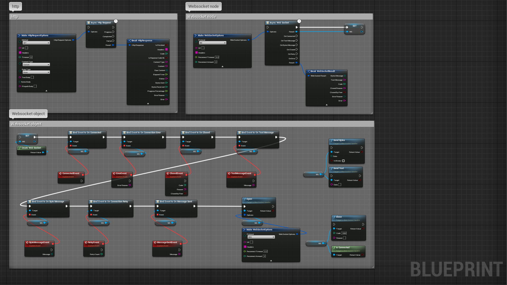
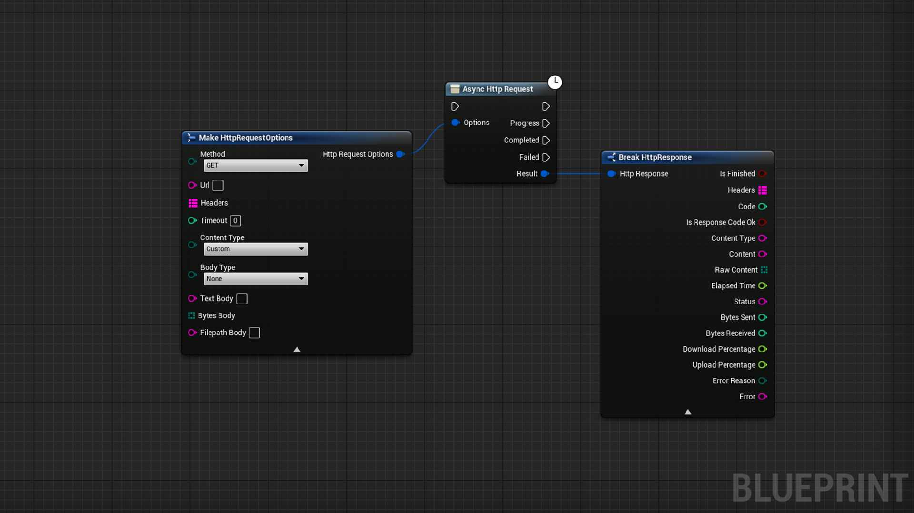
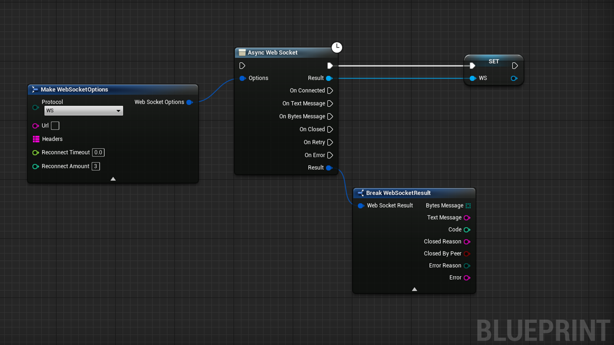
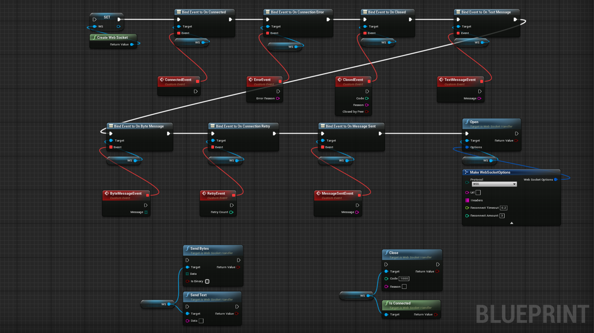

# HttpHelper

 

# About

- UE plugin to handle http/https request and websocket ws/wss communication in an efficient way
- Supports server-sent events (one way communication) and websocket communication (two way communication) with custom headers
- Supports GET, POST, PUT, DELETE, HEAD, PATCH method for http request
- Supports text, binary, file streaming payload for http request
- It exposes ease to use async blueprint functions to quickly make an http(s) request or establish a websocket communication

 

# Setup

1. [Get the plugin on the marketplace](https://www.unrealengine.com/marketplace/en-US/product/http-websocket-helper) and install the plugin for the engine version you wish to use
2. Create or open an unreal engine project with a supported version
3. In the editor, go to Edit/Plugins, search for the plugin, check the box to enable it and restart the editor
4. When a new plugin version is available, go to your Epic Games Launcher, under Unreal Engine/Library, below the engine version, you will find your installed plugins, find the plugin and click on update, then wait for it to finish and restart your editor

 

# Support

### Bugs/Issues

If you encounter issues with this plugin, you **should** report it, to do so, in the editor, go to Edit/Plugins, search for this plugin, click on the plugin support button, this will open your browser and navigate to the plugin issue form where you need to fill in all the relevant details about your issue, this will help me investigate and reproduce it on my own in order to fix it. Be precise and give as many details as you can. Once solved, a new plugin version will be submitted to the marketplace, update the plugin and you are good to go. **Due to epic marketplace limitations, I can only patch/update this plugin for the last 3 engine version, older engine versions will not be supported anymore.**

### Feature requests

If you want a new feature relevant to this plugin use case, you can submit a request in the [plugin marketplace question page](https://www.unrealengine.com/marketplace/en-US/product/http-websocket-helper/questions). I **may** add this new feature in a future plugin version.

 

# Documentation

_Screenshots may differ from the latest plugin version, some features may have evolved or have been removed if deprecated._

 

### Http Request

Make an HTTP request to a server and get an HTTP response

**EHttpContentType** is an enum used to enumerate all the content type known

**EHttpRequestError** is an enum used to enumerate all request error that can happen

**EBodyType** is an enum used to enumerate all body type supported

**EHttpMethod** is an enum used to enumerate all http method supported

**FHttpDataContent** is a struct used to store http data content

**FHttpServerSentEvent** is a struct used to provide server sent event result like Id, Event, Data

**FHttpRequestOptions** is a struct used to provide options like Method, Url, Headers, Timeout, ContentType, BodyType, TextBody, BytesBody, FilepathBody. Always specify a content type when you set a body whether it's text/bytes/file. You can use the preset content type selection to set the content type header, if you want to set a custom one, select the "Custom" option and set it yourself in the headers map, to add a body to your request, specify the body type otherwise there won't be any, you can have a text/bytes/file body

**FHttpResponse** is a struct used to provide response result like IsFinished, IsCanceled, IsTimedOut, IsResponseCodeOk, IsServerSentEvent, Code, Headers, ContentType, Content, Event, ElapsedTime, Status, BytesSent, BytesReceived, DownloadPercentage, UploadPercentage, ErrorReason, Error

#### One node to rule them all (Async)

_The async node returns an http request handler which you can use to cancel the request_

| Node | Inputs | Outputs | Note |
| ---- | ------ | ------- | ---- |
| AsyncHttpRequest | Options(FHttpRequestOptions) | OutHandler(UHttpRequestHandler) | Async node to make an http request with provided options, returns a request handler |
| Progress | | Result(FHttpResponse) | Event triggered during the request to indicate the state of the request, if you download or send a body, you can follow it with the "BytesSent", "BytesReceived", "DownloadPercentage", "UploadPercentage" properties, if "DownloadPercentage" or "UploadPercentage" returns -1, this means the body is empty or the Content-Length header is missing and we can't compute the percentage |
| Completed | | Result(FHttpResponse) | Event triggered when the request was processed and is finished, you can check the "Code" or "IsResponseCodeOk" to confirm the response you have got, code 2xx means the request was a success otherwise it's not |
| Failed | | Result(FHttpResponse) | Event triggered when an error occurs, you can check the "ErrorReason" and "Error" properties to have more details about it |
| OnEvent | | Result(FHttpResponse) | Event triggered when a server sent event is received, you can check "Event" for the payload |

#### Traditional nodes

_Bind to the events before processing the request to receive them properly_

| Node | Inputs | Outputs | Note |
| ---- | ------ | ------- | ---- |
| CreateHttpRequest | | Result(UHttpRequestHandler) | Creates an http request handler |
| ProcessRequest | InOptions(FHttpRequestOptions) | Result(Bool) | Execute this request with specified options |
| CancelRequest | | Result(Bool) | Cancel the ongoing request |
| IsProcessing | | Result(Bool) | Whether the request is still ongoing |
| IsServerSentEvents | | Result(Bool) | Whether the response content type is server sent event |
| OnProgress | | Resonse(FHttpResponse) | Event triggered during the request to track the progress |
| OnHeaderReceived | | Resonse(FHttpResponse) | Event triggered when the response headers are received |
| OnCompleted | | Resonse(FHttpResponse) | Event triggered when the request is done and completed |
| OnFailed | | Resonse(FHttpResponse) | Event triggered when the request is done but failed |
| OnEvent | | Resonse(FHttpResponse) | Event triggered when server sent events are received |

 

### Websocket

Open a two way communication stream between a client and a server

**EWebSocketProtocol** is an enum used to enumerate all protocols supported

**EWebSocketError** is an enum used to enumerate all socket error that can happen

**FWebSocketOptions** is a struct used to provide web socket options like Protocol, Url, Headers, ReconnectTimeout, ReconnectAmount. "ReconnectTimeout" and "ReconnectAmount" allows you to retry a connection when a connection error is catched, specify a timeout greater than 0 and amount greater than 0 to use this feature

**FWebSocketResult** is a struct used to provide web socket result like BytesMessage, TextMessage, Code, ClosedReason, ClosedByPeer, ErrorReason, Error

_Specify the headers before the node activation for them to be taken into account_

#### One node to rule them all (Async)

_The async node returns a websocket handler which you can use to send data or close the connection_

_Calling this async node again won't start another connection unless you have closed the previous one_

| Node | Inputs | Outputs | Note |
| ---- | ------ | ------- | ---- |
| AsyncWebSocket | Options(FWebSocketOptions) | Result(UWebSocketHandler) | Async node to establish websocket communication using specified protocol and headers, returns a websocket handler |
| OnConnected | | Result(FWebSocketResult) | Event triggered when connection is established |
| OnTextMessage | | Result(FWebSocketResult) | Event triggered when a text message is received |
| OnBinaryMessage | | Result(FWebSocketResult) | Event triggered when a binary message is received |
| OnClosed | | Result(FWebSocketResult) | Event triggered when connection is closed |
| OnRetry | | Result(FWebSocketResult) | Event triggered before a connection retry |
| OnError | | Result(FWebSocketResult) | Event triggered when an error occurs, you can check the "ErrorReason" and "Error" properties to have more details about it |

#### Traditional nodes

_Bind to the events before opening the communication to receive them properly_

| Node | Inputs | Outputs | Note |
| ---- | ------ | ------- | ---- |
| CreateWebSocket | | WebSocketHandler | Creates a web socket handler |
| Open | Options(FWebSocketOptions) | Result(Bool) | Open the connection with specified options, returns true if the websockethandler sent the open command, to know if the connection was established successfully, bind to OnConnected event |
| Close | Code(Int), Reason(String) | Result(Bool) | Close the connection, returns true if the websockethandler sent the close command, to know if the connection was terminated, bind to OnClosed event |
| IsConnected | | Result(Bool) | Whether a connection is established and ongoing |
| SendBytes | Data(Array(Byte)), IsBinary(Bool) | Result(Bool) | Sends a bytes message over the communication |
| SendText | Data(String) | Result(Bool) | Sends a string message over the communication |
| OnConnected | | | Event triggered when connection is established |
| OnClosed | | Code(Int), Reason(String), ClosedByPeer(Bool) | Event triggered when connection is closed |
| OnConnectionError | | ErrorReason(String) | Event triggered when an error occurs |
| OnTextMessage | | Message(String) | Event triggered when a text message is received |
| OnBinaryMessage | | Message(Array(Byte)) | Event triggered when a binary message is received |
| OnMessageSent | | Message(String) | Event triggered when a message is sent |
| OnConnectionRetry | | RetryCount(Int) | Event triggered before a connection retry |

### Demos

[Demo Websocket blueprint](https://blueprintue.com/blueprint/8bt0av6s/)